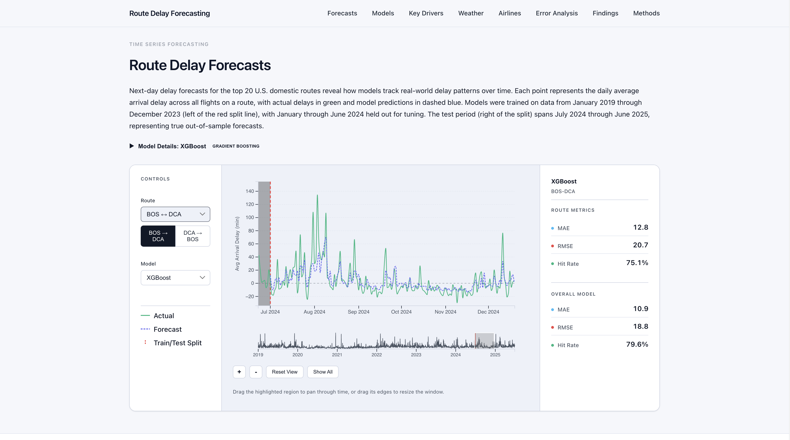
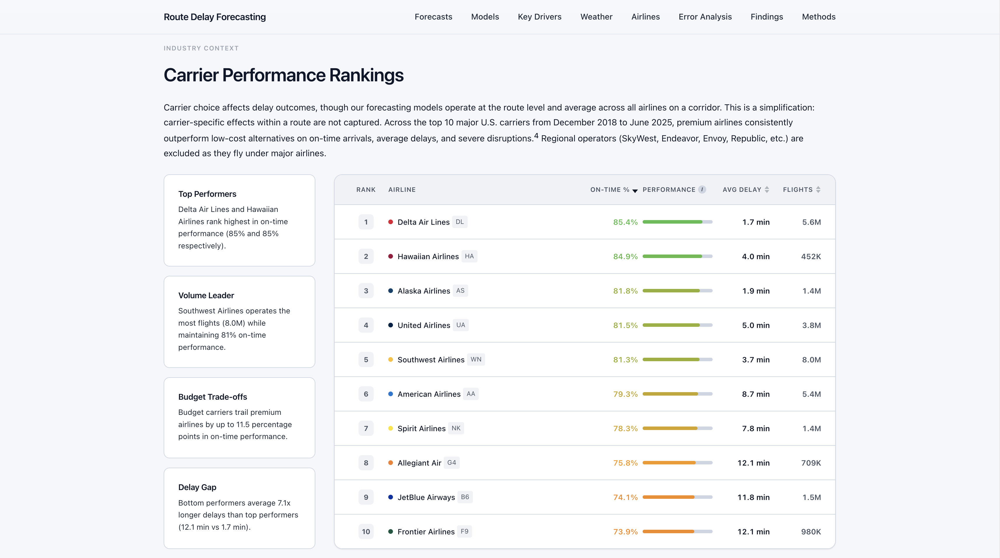

# Route-Level Delay Forecasting

Flight delay forecasting for the 50 busiest U.S. routes using XGBoost, LightGBM, LSTM, and TCN. Trained on 6 years of BTS flight records and Open-Meteo weather data (2019 - June 2025).

**Live dashboard:** [tisyasharma.github.io/flight-delay-forecasting](https://tisyasharma.github.io/flight-delay-forecasting/)

## Results

| Model | MAE | Hit Rate |
|-------|-----|----------|
| XGBoost | 11.25 min | 77.6% |
| LightGBM | 11.25 min | 77.7% |
| LSTM | 12.69 min | 74.42% |
| TCN | 12.79 min | 72.65% |

Metrics from 4-fold walk-forward cross-validation (2023-2024). Gradient boosting outperformed deep learning on every route tested. Removing weather features increased error by 10.3%, the largest impact of any feature group that was created for this project.

## Data

- **Flights:** [BTS On-Time Performance](https://www.transtats.bts.gov/) (Jan 2019 - Jun 2025)
- **Weather:** [Open-Meteo ERA5 reanalysis](https://open-meteo.com/en/docs/historical-weather-api), hourly data aggregated into daily operating-hour metrics

## Notebooks

Notebooks `01-08` walk through EDA, feature engineering, model training, and error analysis. The dashboard includes interactive breakdowns by route, season, and model.
