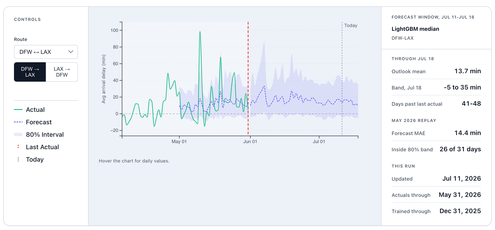
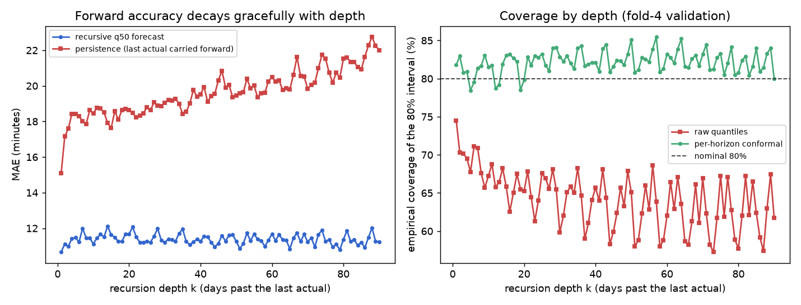

# Flight delay forecasting

[](https://github.com/tisyasharma/flight-delay-forecasting/actions/workflows/ci.yml)

Python, pandas, LightGBM, XGBoost, PyTorch, Optuna, MLflow, conformalized
quantile regression, pytest, React, D3, GitHub Actions.

Most days the 50 busiest US routes run close to schedule. Some days a storm
parks over a hub and pushes a route's average delay past an hour. Airlines pad
block times, position reserve crews, and plan ground delay programs around
that difference, so seeing it coming a week out is a real planning problem.
It is also an oddly hard one in public data: the Bureau of Transportation
Statistics (BTS) publishes flight actuals one to two months late, so the delay
history a forecaster needs always ends weeks in the past, while the weather
driving tomorrow's delays updates every morning.

This system forecasts through that gap, live. Every morning it publishes
seven-day forecasts of average arrival delay, with calibrated 80% intervals,
for all 50 routes. The last published actual is five to ten weeks old, so
reaching seven days out takes roughly 45 to 80 recursive steps, all inside the
90 the backtest validates: the engine feeds its own predictions back in as the
recent-delay history its features expect, and rewidens the intervals at every
depth because uncertainty compounds when a model consumes its own output.
Every forecast is logged before the outcome is knowable and graded in public
as BTS catches up.

**[Live dashboard](https://tisyasharma.github.io/flight-delay-forecasting/)**



The production loop is one GitHub Actions job. Every morning it pulls fresh
weather forecasts, loads the three LightGBM quantile boosters, walks the
forecast out day by day from the last published actual to seven days from now,
then republishes the React dashboard above and appends the run to the
append-only prediction log.

Airlines plan padding and ground delays around the route-day average, not
around individual flights, so that is what this system predicts. Per-flight
prediction needs to know which aircraft flies each leg on the day, information
public data does not carry, so this project does not attempt it.

## Results

Averaged over four half-year walk-forward folds through 2023 and 2024 (train
on the past, score on the next half-year, roll forward), with feature
statistics rebuilt at each fold's own training cutoff. MAE is mean absolute
error in minutes, and the climatology baseline predicts each route's trailing
seasonal norm:

| Measure | Value |
|---|---|
| Median (q50) forecast MAE | 10.80 min (naive baseline 15.12, climatology 13.07) |
| 80% interval coverage | 79.6% after conformal calibration, 75.0% raw |
| Weighted interval score (raw quantiles) | 7.22 min (climatology 8.87, naive 15.12) |
| Bad-day detection (delay > 15 min) | PR-AUC 0.61 against a 22.6% base rate |
| Locked 2025-H1 test, evaluated once | MAE 11.75 (point model), coverage 79.3% (quantile triple) |

Two models ship: the quantile triple that serves, and a separately trained
point model kept as the comparator and locked-test subject. WIS is scored on
the quantiles as issued, before the coverage calibration, and a point
forecast's WIS equals its MAE, which is why the naive number repeats.

The forecasts also hold up far from the data. The table above assumes real
delay lags are available, which is only true one step ahead, so the recursion
backtest re-scores the engine under serving conditions, where every lag past
the origin comes from the model's own predictions. MAE runs 10.7 one day deep,
peaks near 12 after two weeks of recursion, and holds below that peak through
ninety days, while simply carrying the last published actual forward decays
from 15.1 to 22.0. The cost shows up in the intervals instead: raw coverage
falls from 74% to 62% as the recursion deepens, and the per-depth widening
amounts, fit on three folds and checked on a fourth they never touched, bring
it back to an average of 82%. The daily job refuses to serve any depth the
backtest has not validated.



The [model card](docs/model-card.md) records the full protocol, subgroup and
per-route coverage, the locked-test disclosure, and every design decision,
including the tools this project deliberately does not use.

## Getting started

```bash
make setup           # create the venv and install the package
make features        # rebuild the feature table and run the data-quality gates
make walk-forward    # temporal evaluation across folds
make recursive-eval  # recursion-depth backtest with per-horizon widening
make lint test       # ruff + pytest
```

## Project structure

```
src/process.py, src/build_features.py   raw BTS + weather to the feature table
src/features/, src/config.py            feature registry and split constants
src/training/                           trainers, tuning, walk-forward harness
src/models/                             baselines plus the LSTM/TCN comparators
src/forecasting/                        recursive engine and depth backtest
src/evaluation/                         metrics, conformal calibration, plots
src/pipelines/, src/weather/            live weather assembly, daily forecast job
src/monitoring/, src/data_checks.py     drift metrics and data-quality gates
frontend/                               React dashboard (study + live pages)
data/live/predictions/                  append-only forecast log, one file per month
configs/, outputs/, tests/              tuned params, evaluation evidence, pytest
notebooks/                              exploratory analysis through the ceiling study
```

Everything from `make features` onward reproduces from the tracked tables in a
fresh clone. Only the raw BTS ingestion (`src/process.py` and the first notebook)
needs the gitignored `data/raw/`, and the [dataset card](docs/dataset-card.md)
gives the download recipe for rebuilding it.

## Limitations

Point accuracy is capped by a documented predictability ceiling: most of the
squared error lives on severe-weather days, so the useful product is the
calibrated interval rather than the point. The coverage guarantee holds on
average, not for every route individually, and only approximately on
time-ordered data. Per-route coverage still spreads from 72.6% to 87.2% after
calibration. Mondrian (group-conditional) conformal would
address that spread, adaptive conformal inference would address drift, and both
are documented non-goals. The depth
backtest uses observed weather across the horizon, while the live loop runs on
forecast weather for future days, so live accuracy is expected to land somewhat
worse. The prediction log measures that gap as actuals arrive.

## Data

Flights come from the [BTS On-Time Performance](https://www.transtats.bts.gov/)
table, January 2019 through May 2026, public domain. Weather comes from
[Open-Meteo](https://open-meteo.com/), with the historical archive pinned to
`era5` and aviation variables from the historical-forecast API pinned to
`gfs_seamless`. Weather data by Open-Meteo.com,
[CC BY 4.0](https://creativecommons.org/licenses/by/4.0/). Provenance, fill
semantics, exclusions, and the split manifest live in the
[dataset card](docs/dataset-card.md).

## References

Romano, Patterson, and Candès (2019), Conformalized Quantile Regression,
[arXiv:1905.03222](https://arxiv.org/abs/1905.03222). Grinsztajn, Oyallon, and
Varoquaux (2022), Why do tree-based models still outperform deep learning on
tabular data, [arXiv:2207.08815](https://arxiv.org/abs/2207.08815).

MIT licensed.
