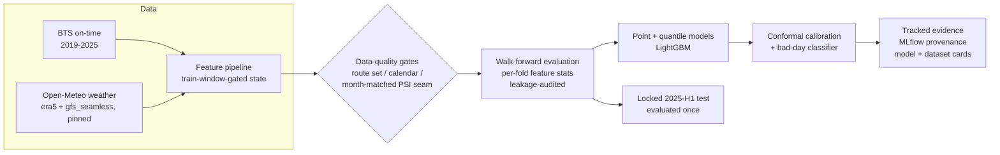
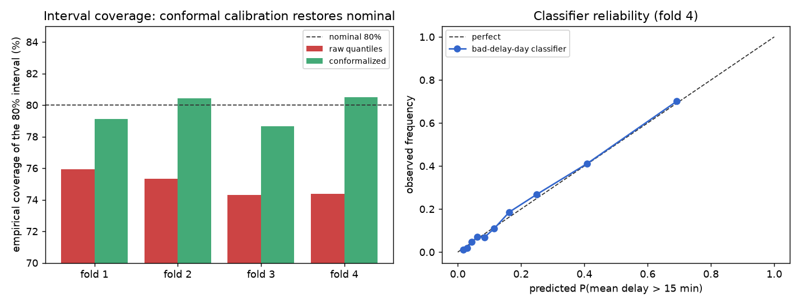

# Route-Level Flight Delay: A Calibrated-Uncertainty Evaluation Study

A rigorous, leakage-audited study of how far daily arrival delay can be predicted for the 50 busiest U.S. routes — and, more importantly, how honestly the **uncertainty** can be quantified. The headline is not a low error number (daily delay is intrinsically hard to predict); it is a system that knows when it cannot be sure, flags high-risk days with a decision-usable probability, and is built with production discipline end to end.

Two questions this project answers well:
- **Which days will be bad?** A gradient-boosted classifier flags days whose mean arrival delay exceeds 15 minutes (≈23% of route-days) with **PR-AUC 0.61 — about 2.7× the base rate — and ROC-AUC 0.82**.
- **How confident should you be?** Conformalized quantile intervals hold their nominal **80% coverage (79.7%, up from an uncalibrated 75.0%)** with a distribution-free finite-sample guarantee.

> **What this is (and isn't).** This is an offline evaluation and uncertainty-calibration study on held-out historical data, run through a strict walk-forward backtest — not a live production forecaster. The dashboard visualizes backtested predictions on past data. A genuine forward-forecasting loop (the model consuming its own predicted lags) is scoped as the next step, not claimed here.

## Architecture


```mermaid
flowchart LR
    subgraph Data
        A[BTS on-time<br/>2019-2025] --> C
        B[Open-Meteo weather<br/>era5 + gfs_seamless, pinned] --> C
    end
    C[Feature pipeline<br/>train-window-gated state] --> D{Data-quality gates<br/>route set / calendar /<br/>month-matched PSI seam}
    D --> E[Walk-forward evaluation<br/>per-fold feature stats<br/>leakage-audited]
    E --> F[Point + quantile models<br/>LightGBM]
    F --> G[Conformal calibration<br/>+ bad-day classifier]
    G --> H[Tracked evidence<br/>MLflow provenance<br/>model + dataset cards]
    E --> I[Locked 2025-H1 test<br/>evaluated once]
```



## Why it is built to a higher bar than the topic suggests

Flight-delay prediction is a common portfolio topic; the differentiator here is engineering discipline, not the task:
- **Leakage-audited temporal validation** — walk-forward folds with feature statistics rebuilt at each fold's own training cutoff, a dedicated leakage test suite, hyperparameters tuned on a 2022 holdout that overlaps no test fold, and a **locked 2025-H1 final test evaluated once**.
- **Uncertainty as the product** — per-quantile calibration measured, then fixed with conformalized quantile regression (`src/evaluation/conformal.py`), then re-measured (figure above).
- **Honest ceiling** — a predictability-ceiling analysis (`notebooks/10_predictability_ceiling.ipynb`) shows lag-only R²≈0.15–0.24 and ~63% of squared error concentrated on ~32% severe-weather days, so the work targets uncertainty and decisions rather than chasing irreducible noise.
- **Production hygiene** — MLflow tracking with git-SHA and data-hash provenance, month-matched-PSI drift gates wired into the build (they caught a real upstream wind-data seam, written up in `docs/incidents/`), a dataset card and model card, a pinned dependency lockfile, and CI that proves a torch-free serving path.

## Results

Primary framing is the decision and the calibration, averaged over four half-year walk-forward folds (2023–2024):

| Metric | Value |
|---|---|
| Bad-delay-day detection (P(delay>15min)) | PR-AUC 0.61 vs 22.6% base rate; ROC-AUC 0.82 |
| 80% interval coverage (conformalized) | 79.7% at 31.6-min mean width |
| 80% interval coverage (raw quantiles) | 75.0% at 29.2-min mean width |

Point accuracy is capped by the predictability ceiling and is reported as secondary context:

| Model | MAE | Within 15 min |
|-------|-----|----------|
| LightGBM quantile (q50) | 10.80 min | 79.7% |
| LightGBM | 11.05 min | 77.9% |
| XGBoost | 11.16 min | 77.6% |
| Climatology quantile (baseline) | 13.07 min | 73.8% |
| Moving average, 7-day (baseline) | 13.53 min | 70.0% |
| Naive, yesterday's delay (baseline) | 15.09 min | 67.7% |
| LSTM / TCN * | 12.69 / 12.79 min | 74.4% / 72.7% |

\* LSTM/TCN predate the current feature set and evaluation protocol; kept for reference, re-evaluated separately.

## Data

- **Flights:** [BTS On-Time Performance](https://www.transtats.bts.gov/) (Jan 2019 – Jun 2025), public domain
- **Weather:** [Open-Meteo](https://open-meteo.com/) historical archive (`era5` pinned) and historical-forecast API (`gfs_seamless` pinned) for aviation variables, hourly data aggregated into daily operating-hour metrics. Weather data by Open-Meteo.com, [CC BY 4.0](https://creativecommons.org/licenses/by/4.0/)

See [docs/dataset-card.md](docs/dataset-card.md) for provenance, fill semantics, exclusions, and the split manifest, and [docs/model-card.md](docs/model-card.md) for intended uses, evaluation protocol, and limitations.

## Quickstart

```bash
make setup           # editable install into a venv, dev + tracking extras
make features        # rebuild the feature table and run the data-quality gates
make walk-forward    # leakage-audited temporal evaluation across folds
make test            # ruff + pytest
```

## Limitations

Daily route-mean delay is a smoothed aggregate, not a per-flight prediction; point accuracy is bounded by the documented predictability ceiling; the intervals' coverage guarantee is marginal and, on temporal data, approximate; and the current artifact is a backtest, not a live forward forecaster. These are stated plainly rather than papered over — knowing the limits is the point.

MIT licensed.
