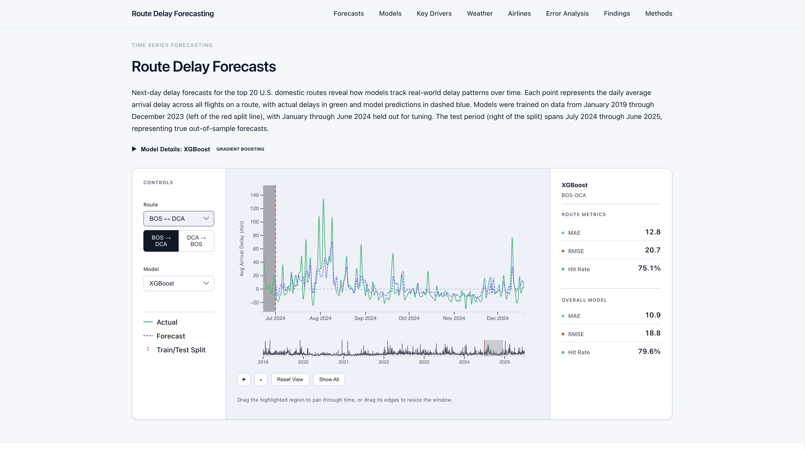
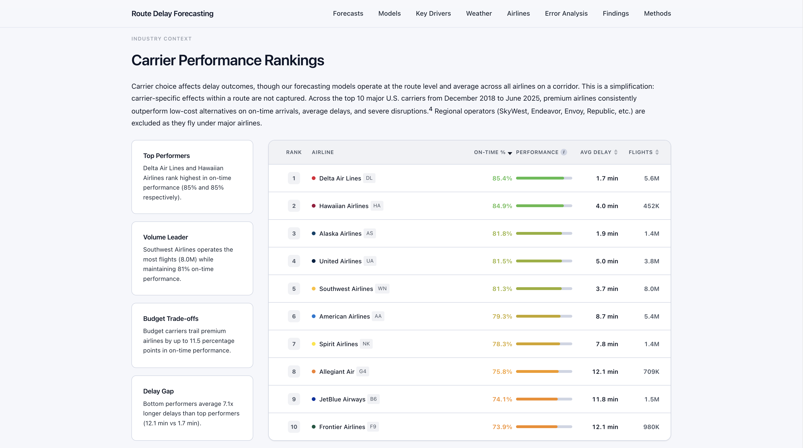

# Route-Level Delay Forecasting

Flight delay forecasting for the 50 busiest U.S. routes using XGBoost, LightGBM, LSTM, and TCN, with quantile models for calibrated prediction intervals. Trained on 6.5 years of BTS flight records, ERA5-pinned Open-Meteo weather, and GFS aviation weather (2019 - June 2025).

**Live dashboard:** [tisyasharma.github.io/flight-delay-forecasting](https://tisyasharma.github.io/flight-delay-forecasting/)

## Results

| Model | MAE | Hit Rate |
|-------|-----|----------|
| LightGBM quantile (q50) | 10.80 min | 79.7% |
| LightGBM | 11.05 min | 77.9% |
| XGBoost | 11.16 min | 77.6% |
| LSTM * | 12.69 min | 74.4% |
| TCN * | 12.79 min | 72.7% |
| Climatology quantile baseline | 13.07 min | 73.8% |
| Moving Average (7-day) | 13.53 min | 70.0% |
| Naive (yesterday's delay) | 15.09 min | 67.7% |
| Seasonal naive (same weekday last week) | 17.24 min | 62.8% |

Gradient boosting cuts MAE by 27% against the naive baseline and beats deep learning on every route tested. The quantile model's 80% interval covers 75.0% of actuals at a 29-minute mean width, against 76.5% at 39 minutes for the climatology baseline, and beats it on every pinball loss. Metrics are averaged over four half-year walk-forward folds (2023-2024) with feature statistics rebuilt at each fold's own training cutoff; hyperparameters were tuned on a 2022 holdout that overlaps no fold's test window; 2025 H1 is a locked final test reserved for the release evaluation.

\* LSTM/TCN numbers predate the current feature set and evaluation protocol; they are re-evaluated in the deep-learning investigation phase.

## Data

- **Flights:** [BTS On-Time Performance](https://www.transtats.bts.gov/) (Jan 2019 - Jun 2025), public domain
- **Weather:** [Open-Meteo](https://open-meteo.com/) historical archive (`era5` pinned) and historical-forecast API (`gfs_seamless` pinned) for aviation variables (visibility, CAPE, freezing rain, gusts, low cloud), hourly data aggregated into daily operating-hour metrics. Weather data by Open-Meteo.com, [CC BY 4.0](https://creativecommons.org/licenses/by/4.0/)

See [docs/dataset-card.md](docs/dataset-card.md) for provenance, fill semantics, exclusions, and the split manifest, and [docs/model-card.md](docs/model-card.md) for intended uses, evaluation protocol, and limitations.

## Notebooks

Notebooks `01-08` walk through EDA, feature engineering, model training, and error analysis; `10` quantifies the predictability ceiling (variance decomposition, error concentration on severe-weather days). The dashboard includes interactive breakdowns by route, season, and model.
