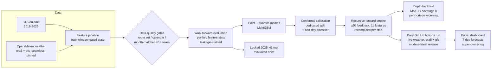

# Route-Level Flight Delay Forecasting with Calibrated Uncertainty

A rigorous, leakage-audited forecasting system for daily arrival delay on the 50
busiest U.S. routes. It publishes a rolling 7-day-ahead forecast every morning —
which, because BTS actuals arrive a month or more late, means recursively
consuming its own predictions 40 to 80 days deep depending on where the monthly
publication cycle stands, with every depth's accuracy and interval calibration
validated by a dedicated backtest. The headline is not a low error number —
daily delay is intrinsically hard to predict — it is a system that knows when
it cannot be sure and proves it.

**[Live dashboard](https://tisyasharma.github.io/flight-delay-forecasting/)** — a
daily GitHub Actions run rolls the engine forward from the last published BTS
actual through seven days past today and republishes forecasts for all 50
routes, with the recursion made visible: every point on the chart sits past
the last published actual, the model consuming its own predictions. Each run's
published horizon is logged to an append-only record that is never rewritten,
so the forecasts can be graded against actuals as BTS publishes each month.

The model behind the live forecasts is a newer serving generation, trained
through 2025-12-31 on the extended table and calibrated on disjoint early-2026
windows. Every evaluation number on this page belongs to the earlier evaluated
generation (2024-01-01 training cutoff) under the locked protocol — the serving
generation's own test is the live record itself, graded in public as actuals
land. The [model card](docs/model-card.md) documents both generations.

Three questions this project answers well:

- **Which days will be bad?** A gradient-boosted classifier flags days whose
  mean arrival delay exceeds 15 minutes (≈23% of route-days) with **PR-AUC 0.61
  — about 2.7× the base rate — and ROC-AUC 0.82**.
- **How confident should you be?** Conformalized quantile intervals hold their
  nominal **80% coverage (79.6%, up from an uncalibrated 75.0%)** with a
  distribution-free finite-sample guarantee, fit on a dedicated calibration
  split that model selection never touches.
- **What does forecasting forward actually cost?** BTS publishes actuals one to
  two months late, so a real forecaster must roll its own predictions into its
  lag features — 40 to 80 days deep by the time the public 7-day horizon ends,
  depending on how long ago the last month of actuals landed. The recursive
  engine quantifies the damage honestly: MAE decays from 10.7 (one step) to ~12
  and stays far below the 15.1-minute naive baseline through depth 90, while
  uncalibrated interval coverage quietly rots from 74% into the low 60s — and
  per-horizon conformal widening restores an average of 82% (per-depth range
  78.5-85.5) on an untouched validation fold.

## Architecture


```mermaid
flowchart LR
    subgraph Data
        A[BTS on-time<br/>2019-2025] --> C
        B[Open-Meteo weather<br/>era5 + gfs_seamless, pinned] --> C
    end
    C[Feature pipeline<br/>train-window-gated state] --> D{Data-quality gates<br/>route set / calendar /<br/>month-matched PSI seam}
    D --> E[Walk-forward evaluation<br/>per-fold feature stats<br/>leakage-audited]
    E --> F[Point + quantile models<br/>LightGBM]
    F --> G[Conformal calibration<br/>dedicated split<br/>+ bad-day classifier]
    G --> H[Recursive forward engine<br/>q50 feedback, 11 features<br/>recomputed per step]
    H --> I[Depth backtest<br/>MAE k / coverage k<br/>per-horizon widening]
    E --> J[Locked 2025-H1 test<br/>evaluated once]
    H --> K[Daily GitHub Actions run<br/>live weather, era5 + gfs<br/>models-latest release]
    K --> L[Public dashboard<br/>7-day forecasts<br/>append-only log]
```

## Forecasting forward, honestly

The backtest table cannot forecast: its delay-lag features come straight from
actuals that would not exist at serving time. `src/forecasting/recursive.py`
rolls the median prediction forward day by day, recomputing all eleven
target-dependent features (lags, rolling stats, ewm, and the cross-route hub
inbound-delay state) from the mixed actual+predicted series. A full-depth
parity test pins the recomputation to the training feature pipeline exactly —
feed the engine an oracle that "predicts" the true actuals and every feature
must match the built table at every depth (`tests/test_recursive.py`).


The right panel is the finding most portfolio forecasters never surface:
prediction intervals that are honest one step ahead quietly lose 11 points of
coverage by a month of recursion depth and bottom out near 62%. Per-horizon
conformal offsets (fit on three folds, validated on the fourth) grow from 1.5
to roughly 4.6 minutes and hold validated coverage at an average of 82%
(per-depth range 78.5-85.5) where the raw intervals decay into the low 60s.
Full curves in `outputs/recursive_eval.json`.


## Why it is built to a higher bar than the topic suggests

Flight-delay prediction is a common portfolio topic; the differentiator here is
engineering discipline, not the task:

- **Leakage-audited temporal validation** — walk-forward folds with feature
  statistics rebuilt at each fold's own training cutoff, a dedicated leakage
  test suite, hyperparameters tuned on a 2022 holdout that overlaps no test
  fold, and a **locked 2025-H1 final test evaluated once**.
- **Uncertainty as the product** — per-quantile calibration measured, then
  fixed with conformalized quantile regression (`src/evaluation/conformal.py`),
  then re-measured — marginally, on severe-weather days, per route, and at
  every recursion depth.
- **Honest ceiling** — a predictability-ceiling analysis
  (`notebooks/10_predictability_ceiling.ipynb`) shows lag-only R²≈0.15–0.24 and
  ~63% of squared error concentrated on ~32% severe-weather days, so the work
  targets uncertainty and decisions rather than chasing irreducible noise.
- **Production hygiene** — MLflow tracking with git-SHA and data-hash
  provenance, month-matched-PSI drift gates wired into the build (they caught a
  real upstream wind-data seam, written up in `docs/incidents/`), a dataset
  card and model card, a pinned dependency lockfile, and CI that proves a
  torch-free serving path.

## Results

Decision and calibration metrics, averaged over four half-year walk-forward
folds (2023–2024):

| Metric | Value |
|---|---|
| Bad-delay-day detection (P(delay>15min)) | PR-AUC 0.61 vs 22.6% base rate; ROC-AUC 0.82 |
| 80% interval coverage (conformalized) | 79.6% at 31.7-min mean width |
| 80% interval coverage (raw quantiles) | 75.0% at 29.2-min mean width |
| Severe-weather-day coverage (conformalized) | 79.7% (76.3% raw) |

Forward forecasting by recursion depth (pooled across folds; persistence
carries the last actual forward):

| Depth past last actual | Recursive MAE | Persistence MAE | Coverage, calibrated* |
|---|---|---|---|
| k=1 | 10.7 | 15.1 | 81.8% |
| k=7 | 12.0 | 18.0 | 81.4% |
| k=14 | 12.1 | 17.9 | 81.9% |
| k=48 | 11.6 | 20.1 | 81.8% |
| k=90 | 11.2 | 22.0 | 80.0% |

\* validated on fold 4, which the per-horizon offsets were never fit on. The
backtest validates every depth through k=90. Serving depth cycles with the
monthly BTS publication: roughly 45 right after a month of actuals lands,
climbing toward 80 just before the next month publishes — and the daily job
refuses to serve any depth beyond the deepest validated offset.

Point accuracy is capped by the predictability ceiling and is reported as
secondary context:

| Model | MAE | Within 15 min |
|-------|-----|----------|
| LightGBM quantile (q50) | 10.80 min | 79.7% |
| LightGBM | 11.05 min | 77.9% |
| XGBoost | 11.16 min | 77.6% |
| Climatology quantile (baseline) | 13.07 min | 73.8% |
| Moving average, 7-day (baseline) | 13.53 min | 70.0% |
| Naive, yesterday's delay (baseline) | 15.09 min | 67.7% |
| LSTM / TCN * | 12.69 / 12.79 min | 74.4% / 72.7% |

\* LSTM/TCN numbers come from the earlier v1-feature evaluation protocol and
are shown for scale only — they are not part of the tracked results evidence,
and deep models were deliberately not pursued further once gradient boosting
won on this data size.

**Locked final test** — 2025-H1 was reserved as a one-shot holdout and
evaluated exactly once at release: LightGBM MAE 11.75 (vs 11.05 walk-forward —
a fresh half-year runs a little softer, stated rather than smoothed over), and
the 80% interval covered **79.3% conformalized** (73.4% raw), so the
calibration held on a window it had never seen. The protocol and disclosure
live in the [model card](docs/model-card.md).

## Data

- **Flights:** [BTS On-Time Performance](https://www.transtats.bts.gov/)
  (Jan 2019 – May 2026, extended monthly), public domain
- **Weather:** [Open-Meteo](https://open-meteo.com/) historical archive (`era5`
  pinned) and historical-forecast API (`gfs_seamless` pinned) for aviation
  variables, hourly data aggregated into daily operating-hour metrics. Weather
  data by Open-Meteo.com, [CC BY 4.0](https://creativecommons.org/licenses/by/4.0/)

See [docs/dataset-card.md](docs/dataset-card.md) for provenance, fill
semantics, exclusions, and the split manifest, and
[docs/model-card.md](docs/model-card.md) for intended uses, evaluation
protocol, and limitations.

## Quickstart

```bash
make setup           # editable install into a venv, dev + tracking extras
make features        # rebuild the feature table and run the data-quality gates
make walk-forward    # leakage-audited temporal evaluation across folds
make recursive-eval  # recursion-depth backtest with per-horizon widening
make test            # ruff + pytest
```

## Limitations

Daily route-mean delay is a smoothed aggregate, not a per-flight prediction,
and point accuracy is bounded by the documented predictability ceiling. The
depth backtest uses observed weather across the horizon; the live loop
substitutes forecast weather for the future days and is expected to land
somewhat worse — the monitoring record will show by how much. The conformal
guarantee is marginal and, on temporal data, approximate — split conformal
assumes exchangeability, and the residual per-route coverage spread
(72.6–87.2% after calibration) is exactly the gap that Mondrian
(group-conditional) conformal addresses, as adaptive conformal inference does
for drift; both are named rather than implemented, so the boundary of the
claim is explicit.

MIT licensed.
